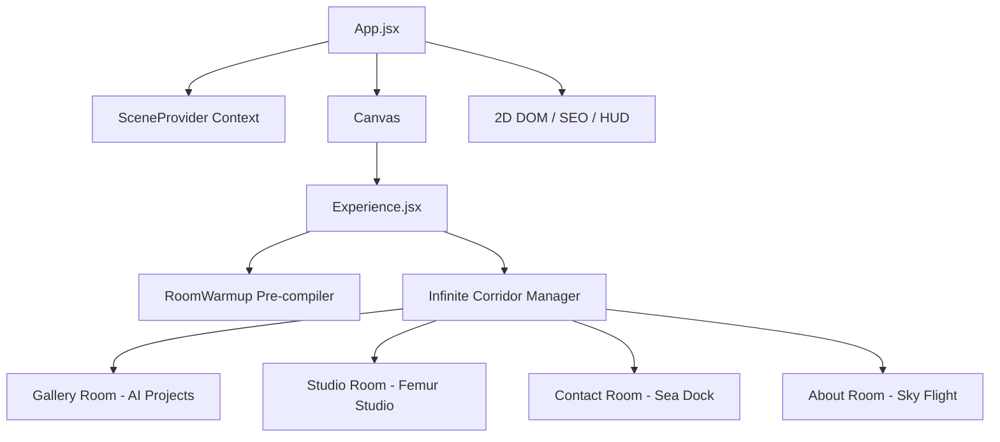

# 🎨 Prashant Yadav | Interactive 3D AI Engineer Portfolio

<div align="center">
  
  
  
  
  
</div>

<br/>

Interactive 3D WebGL developer portfolio of **Prashant Yadav**, AI Engineer and Founding Member at **Femur Studio**. This project features a hand-drawn paper-and-ink comic aesthetic where sketch drawings dynamically reveal colored paint on hover and interaction.

> [!NOTE]
> Ensure hardware acceleration is enabled in your browser settings for smooth 60 FPS WebGL rendering.

---

## 🚀 Key Architectural Highlights

1. **Spatial WebGL & React Three Fiber:** Built with React 19, Three.js, and React Three Fiber to render an interactive corridor, project gallery, monitor stack, and first-person paper airplane flight.
2. **Dynamic 3D Typography:** Custom procedural split animations on the 8-letter hero typography (`PRASHANT`) that react symmetrically to camera scroll.
3. **Dual Content Pipeline:** Local static configuration for instant zero-dependency builds, with full headless Sanity CMS schema compatibility.
4. **Interactive Contact Paper:** Web3Forms integration featuring bigram NLP content analysis, rate limiting, and domain verification.
5. **Semantic SEO & Accessibility:** Full headless DOM fallback tree (`#seo-content`), Schema.org JSON-LD structured metadata, and a dedicated screen reader overlay (`ScreenReaderOverlay.jsx`).

---

## 🏗️ 3D Scene Architecture



---

## 🛠️ Local Development Setup

1. **Clone the repository:**
   ```bash
   git clone https://github.com/echoistprashant/port.git
   cd port
   ```

2. **Install dependencies:**
   ```bash
   npm install
   ```

3. **Start local development server:**
   ```bash
   npm run dev
   ```

4. **Production Build:**
   ```bash
   npm run build
   npm run preview
   ```

---

## 📬 Contact & Links

- **GitHub:** [@echoistprashant](https://github.com/echoistprashant)
- **LinkedIn:** [Prashant Yadav](https://www.linkedin.com/in/echoistprashant/)
- **X (Twitter):** [@ConstPrashant](https://x.com/ConstPrashant)
- **Instagram:** [@echoistprashant](https://www.instagram.com/echoistprashant/)
- **Studio:** [Femur Studio](https://femur.studio/)
